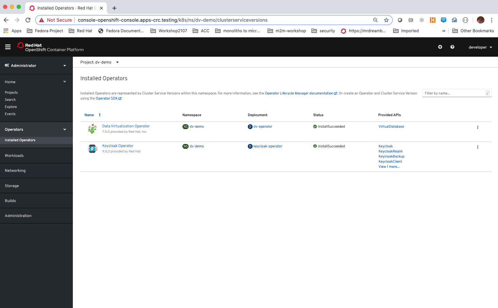
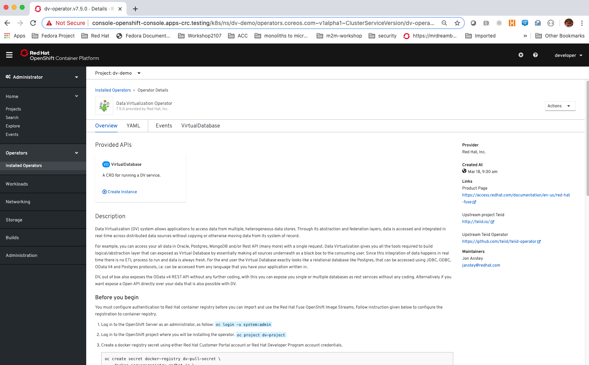
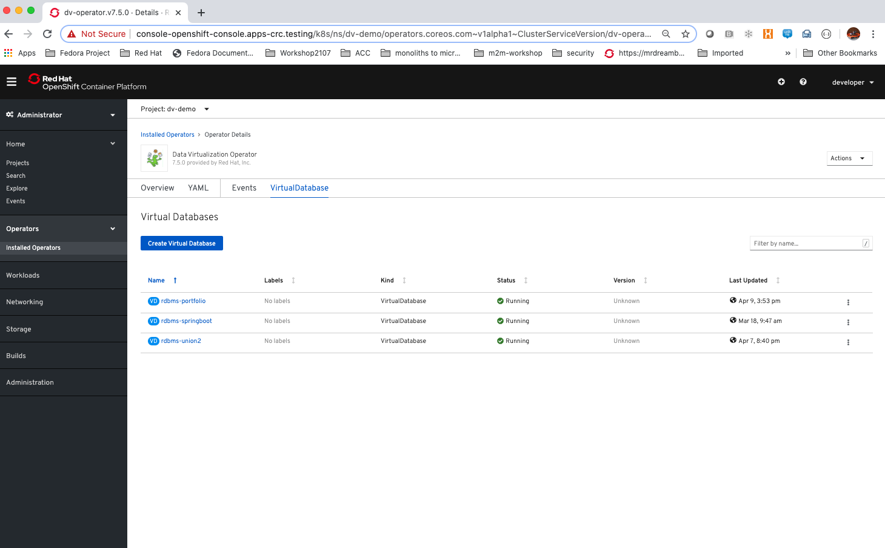
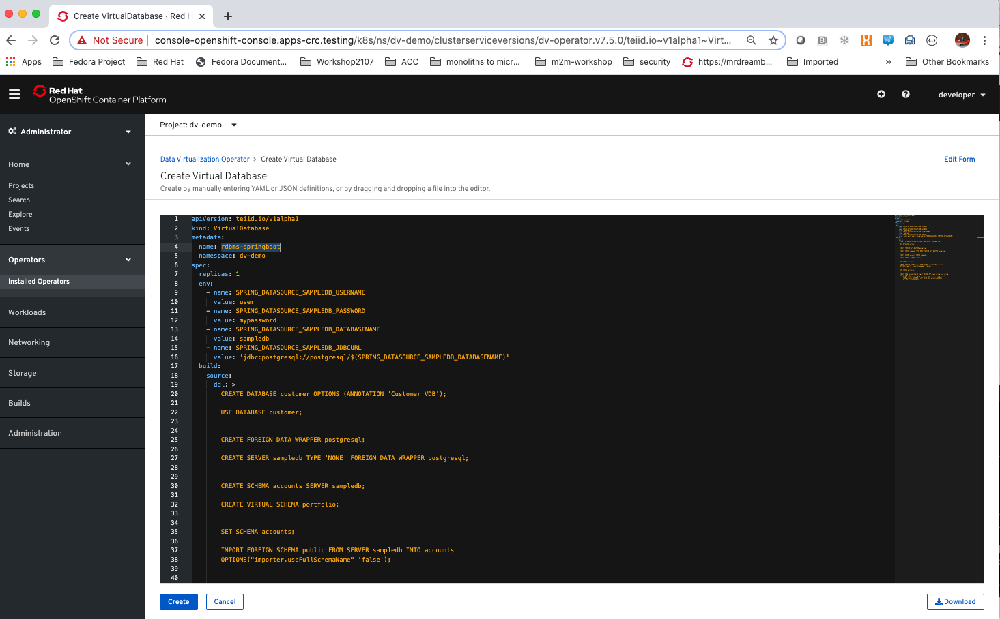
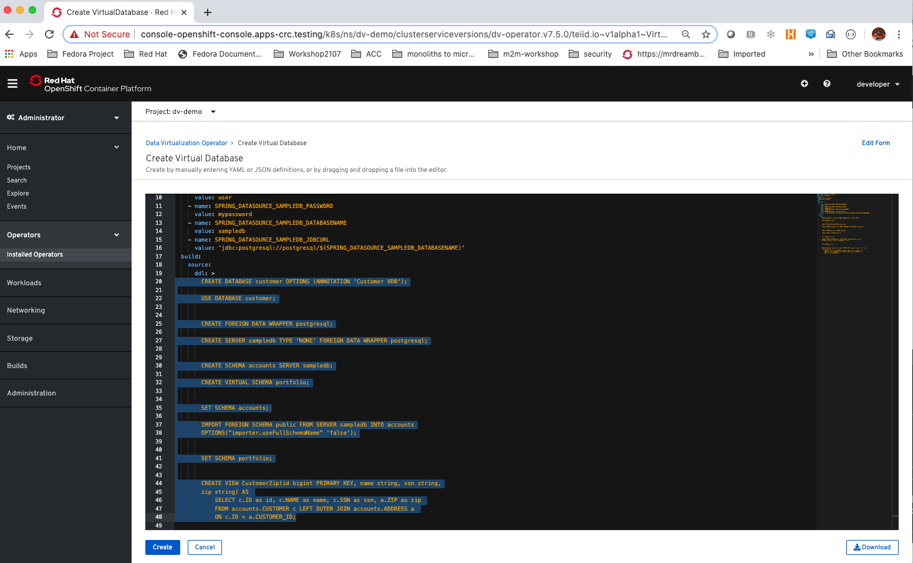
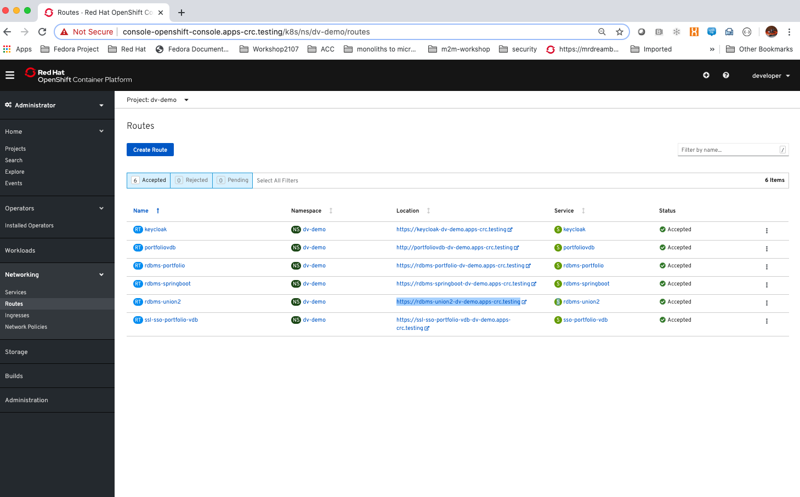
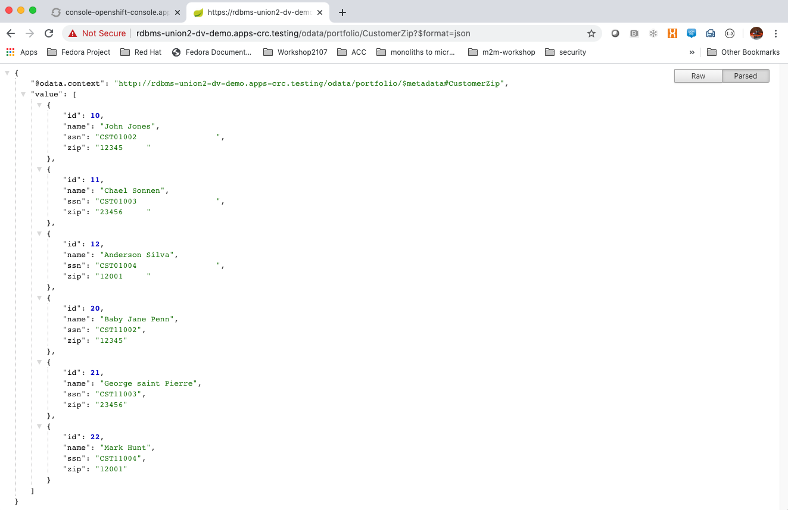
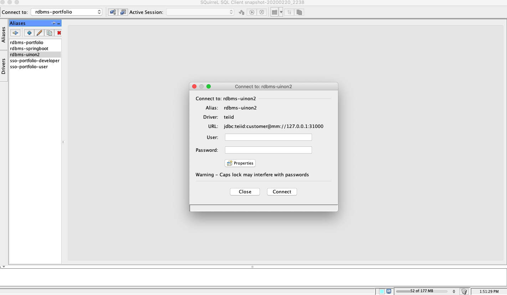
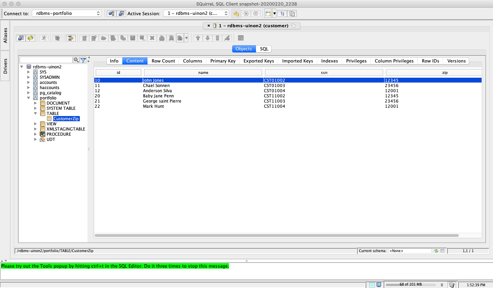

# using-data-virtualization-operator

This is Part 2 in my Data Virtualization series. You can watch the Part 1 video at: 
https://youtu.be/lwLzqfgjGks
The video on using the Data Virtualization Operator to create a Virtual Database (VDB) can be found at:
https://youtu.be/Ny1SwwHM_gc

## 1 Introduction

## 2 Using the Data Virtualization Operator
Please watch the video on how to install the Data Virtualization Operator. Once installed, you can follow to instructions below to create a VDB to implement the use case described in the video ie, create a single view for 2 databases.

### 2.1 Create the VDB

Log in to the Openshift console. Click on Operators->Installed Operators to see the installed operators:

Click on Data Virtualzation Operator to see the Operator Details:

Click on VirtualDatabase to see a list of VDBs that have been created. Create a new VDB by clicking on the "Create Virtual Database" button.

### 2.2 Change the name of the VDB
Clicking on the "Create Virtual Database" button brings up a yaml file definition of a VDB in an editor. Change the name of VDB from rhdbms-springboot to a name that you want to give to the VDB.

### 2.3 Replace the DDL
Replace the content of the ddl (selected VDB definition) with the content of the rdbms-union2.ddl file.

### 2.4 Add MySQL credentials to the environmental variables
Page up to the location shown in the screenshot and insert the credentials for the MySQL database by copying and pasting the content of file mysql-en.txt at the location shown.

### 2.5 Let the Data virtualization Operator build the VDB
Click on the Create button to build the VDB. The Data Virtualization Operator will create a maven project, generate Spring Boot code with an application.properties file, then build and deploy the VDB on to Openshift and create a route for it.

## 3 Interacting with the VDB
I am going to show 2 ways to interact with the VDB by using ODATA and JDBC.

### 3.1 Using ODATA
Click on Networking->Route to identify the base URL to access the VDB.

You can interact with it from your browser by appending the following to the base URL:

<pre>
/odata/portfolio/CustomerZip
/odata/portfolio/CustomerZip?$format=json
/odata/portfolio/CustomerZip?$format=json&$top=3
/odata/portfolio/CustomerZip(1)?$format=json
</pre>

Here is a screenshot of the results from the 2nd URL above.

### 3.2 Using JDBC
I am using the Squirrel SQL client in my demo. You may use other SQL clients of your choosing. If you should want to use Squirrel SQL client, here is the link to the official site: http://squirrel-sql.sourceforge.net

From the Squirrel SQL Client, install the Teiid JDBC driver with Class Name: **org.teiid.jdbc.TeiidDriver** and set up an alias and point the URL to: jdbc:teiid:customer@mm://127.0.0.1:31000 
There is no need to set the User and Password.

Before you can connect to the VDB using JDBC, you need to login to Openshift, change to the project where the VDB resides and execute the following command from the command line:

<pre>
oc port-forward $(oc get pods -o=jsonpath='{.items[0].metadata.name}' -l app=rdbms-union2) 35432 31000
</pre>

Then you fire up SquirrelSQL CLient and connect to the VDB. Note the JDBC URL in the screenshot. No user Id or password is needed for this example. We shall talk about security in subsequent videos.

You can expand the portfolio structure and select "content" to see the data in the single view VDB. You will see that it combines the 3 entries in each database resulting in 6 entries.

## 4 Conclusions
I've showed you how to create a VDB using the Data Virtualization Operator. You can try it out and crate a VDB of your own. In the next instalment, I shall show you how to create a VDB using Spring Boot and manage the security using Keycloak.
